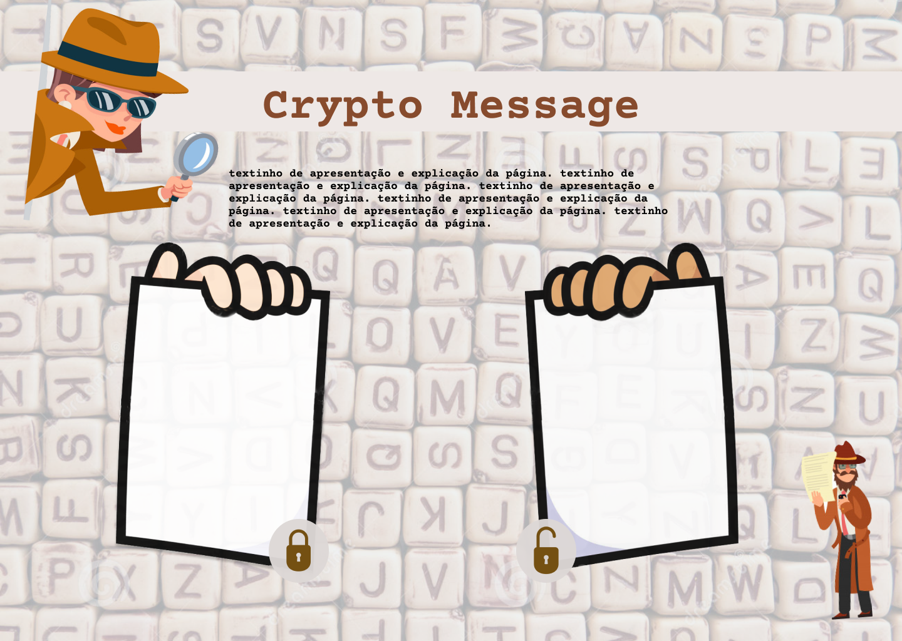

# :female_detective: Crypto Detective :male_detective:

A aplicação web (webApp) Crypto Detective, tem como alvo o público infanto-juvenil. Nela, esses usuários poderão ter um primeiro contato com o conceito de criptologia, através da cifra de césar. 
---
## :card_index_dividers: Tabela de conteúdos

   * [Sobre](#Crypto)
   * [Tabela de Conteúdo](#Tabela)
   * [Layout](#Layout)
   * [Status do projeto](#Status)
   * [Tecnologias utilizadas](#Tecnologias)
   * [Sobre a autora](#Sobre)

## :paintbrush: Layout
    
Com o objetivo de chamar atenção do público alvo, ficou-se decidido explorar o interessante mundo dos detetives, apresentando aos usuários dois personagens: Ágata e Artur, detetives especialistas em codificar e decodificar mensagens. Todo o layout e paleta de cores da aplicação foi definido a partir da escolha das personagens.
    
O funcionamento da aplicação é bem simples: existem dois quadros onde o usuário poderá escrever, no primeiro (à esquerda) será possível codificar uma mensagem, enquanto no segundo (à direita) será possível decifrá-la, basta o usuário escolher uma chave de deslocamento para cifra.
    
Esboço do layout:

## :hammer_and_wrench: Status do projeto

:construction_worker_woman: Em construção...: construction_worker_man:

## :computer: Tenologias utilizadas

- HTML 5
- CSS3
- JavaScript
- Node.js

## :copyright: Sobre a autora

### Bruna Belo
[Bruna Belo](https://github.com/belobruna)
bruna.belo@gmail.com
